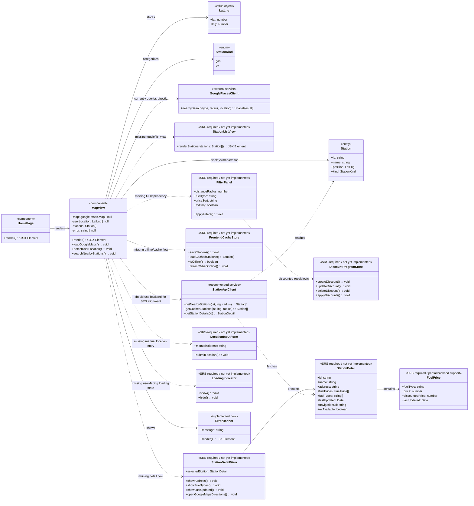
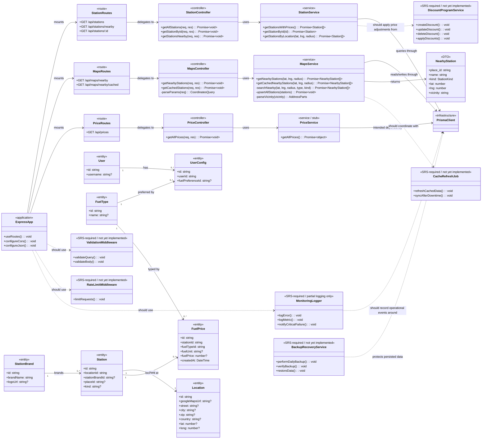

# Find A Pump Class Diagrams

These class diagrams model the current codebase and the additional classes implied by the SRS.

- `Implemented now` means the responsibility exists in the repository today.
- `SRS-required / not yet implemented` means the requirement appears in the SRS but no dedicated class or module exists yet.
- The frontend is a React application built with function components, so the UML uses architectural classes and stereotypes rather than literal TypeScript `class` declarations.

## Frontend Class Diagram

### Frontend Review Against Current Code

- Implemented now:
  - `HomePage` only renders `MapView`.
  - `MapView` loads Google Maps, reads browser geolocation, searches nearby gas and EV stations, renders markers, and shows a simple error banner.
  - `Station`, `LatLng`, and `StationKind` exist as local TypeScript types in the map component.
- Missing relative to the SRS:
  - Manual location input.
  - List view and map/list toggle.
  - Distance, fuel type, and price filters.
  - Marker selection summary and detailed station view.
  - Fuel price display per station.
  - Discount program CRUD and discount application.
  - Offline caching and cached fallback behavior in the frontend.
  - Explicit loading indicator component and accessibility-focused UI modules.

## Backend Class Diagram

### Backend Review Against Current Code

- Implemented now:
  - Express app wiring with CORS and JSON middleware.
  - Route, controller, and service separation for stations, maps, and prices.
  - `MapsService` calls the Google Places API, returns nearby gas and EV stations, and asynchronously upserts station/location/brand cache data into Prisma.
  - `StationService` returns stations with `Location`, `StationBrand`, and sorted `FuelPrice` relations.
  - Prisma entities exist for users, user config, fuel types, fuel prices, stations, locations, and brands.
  - Basic automated tests exist for the frontend map component and the station controller/service layers.
- Partial or missing relative to the SRS:
  - `PriceService` is still a stub and does not expose real pricing logic.
  - No backend discount-program model or CRUD endpoints.
  - No dedicated cache refresh scheduler, offline synchronization job, or stale-data policy.
  - Input validation is limited to a few numeric query checks in `MapsController`; there is no shared validation middleware.
  - No API rate limiting.
  - Logging is ad hoc `console` logging plus a Google Maps API log file, not full monitoring/alerting.
  - No backup/recovery module in the application code.

## Summary

The repository currently supports the beginning of the SRS core display flow:

- detect user location,
- show a map,
- show gas and EV markers,
- query nearby station data,
- persist basic station cache data on the backend.

The largest SRS gaps are search/filter UX, detailed station pricing presentation, discount management, offline/cache orchestration, validation/security middleware, and operational services such as rate limiting, monitoring, and backup/recovery.