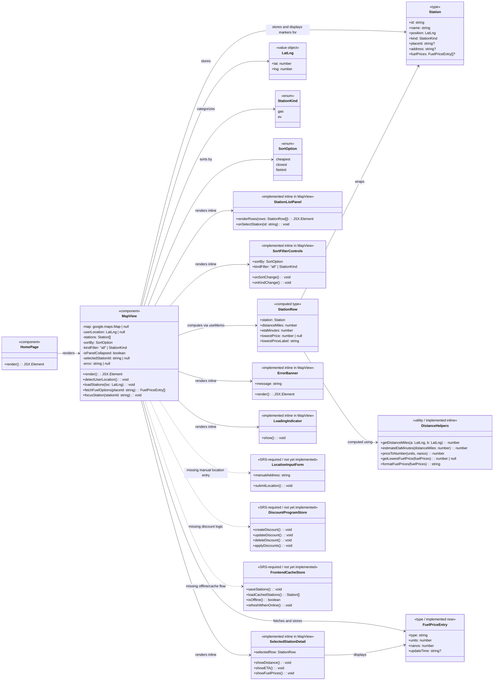
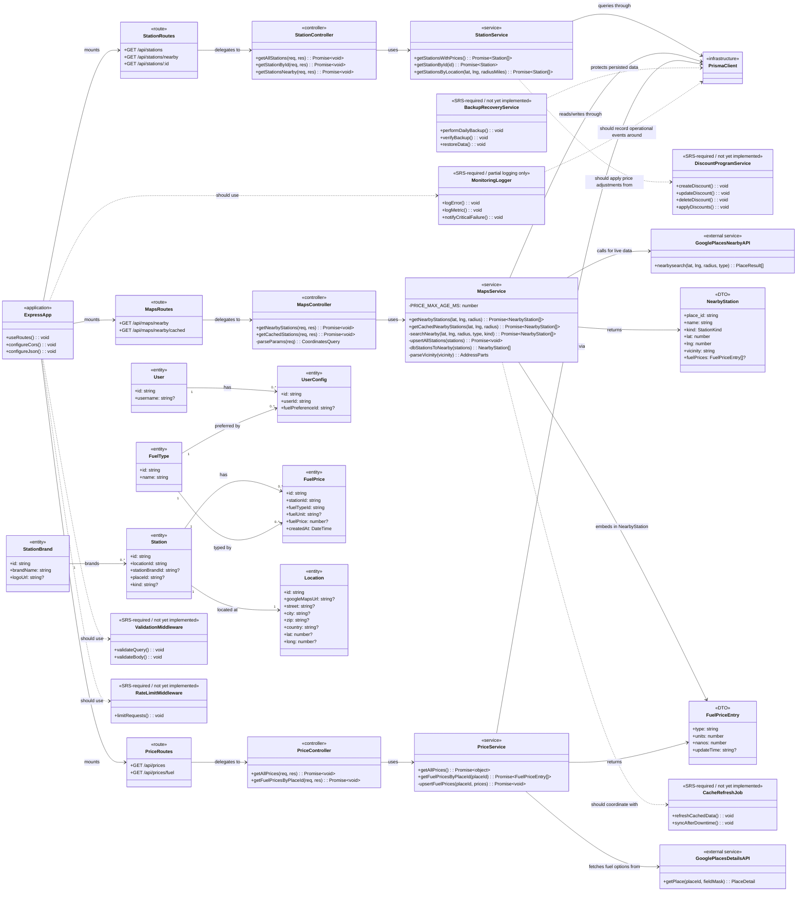

# Find A Pump Class Diagrams

These class diagrams model the current codebase and the additional classes implied by the SRS.

- `Implemented now` means the responsibility exists in the repository today.
- `SRS-required / not yet implemented` means the requirement appears in the SRS but no dedicated class or module exists yet.
- `Implemented inline` means the responsibility exists but as logic embedded in another component rather than a dedicated class.
- The frontend is a React application built with function components, so the UML uses architectural classes and stereotypes rather than literal TypeScript `class` declarations.

## Frontend Class Diagram

### Frontend Review Against Current Code

- Implemented now:
  - `HomePage` renders `MapView`.
  - `MapView` uses `@react-google-maps/api` for map rendering, browser geolocation, loads the fallback area immediately, and re-fetches when the user's actual coordinates arrive.
  - Station list panel is rendered inline within `MapView` with sort (cheapest/closest/fastest ETA) and kind (all/gas/EV) filter controls.
  - Selected-station detail strip shows distance, ETA, and per-fuel-type prices for the highlighted station.
  - `MapView` now fetches stations from the backend (`/api/maps/nearby/cached` with a background refresh via `/api/maps/nearby`) instead of calling Google Places directly.
  - Fuel prices per station are fetched from the backend (`/api/prices/fuel?placeId=`) and shown in the detail strip for gas stations.
  - `Station`, `LatLng`, `StationKind`, `FuelPriceEntry`, `StationRow`, and `SortOption` exist as local TypeScript types.
  - Distance and ETA helpers (`getDistanceMiles`, `estimateEtaMinutes`) are implemented as inline utility functions.
  - Inline error banner and "Loading map..." loading state exist.
- Missing relative to the SRS:
  - Manual location input (`LocationInputForm`).
  - No EV charging directions or navigation link.
  - Discount program CRUD and discount application (`DiscountProgramStore`).
  - Offline caching and cached fallback behavior in the frontend (`FrontendCacheStore`).
  - Dedicated accessibility-focused `LoadingIndicator` component (currently just inline text).

## Backend Class Diagram

### Backend Review Against Current Code

- Implemented now:
  - Express app wiring with CORS (allowlist + private-network pattern) and JSON middleware.
  - Route, controller, and service separation for stations, maps, and prices.
  - `MapsService` calls the Google Places Nearby Search API, returns nearby gas and EV stations, and asynchronously upserts station/location/brand cache data into Prisma. `getCachedNearbyStations` now includes fresh fuel prices (within 24 h) from the DB when returning cached results.
  - `StationService` returns stations with `Location`, `StationBrand`, and sorted `FuelPrice` relations. `getStationsByLocation` performs a bounding-box query using lat/long deltas.
  - `PriceService` now has a functioning `getFuelPricesByPlaceId` that calls the Google Places Details API (v1), returns the fuel price breakdown, and asynchronously upserts the results into `FuelPrice` and `FuelType` rows via Prisma.
  - `PriceRoutes` exposes a new `GET /api/prices/fuel?placeId=` endpoint backed by `PriceController.getFuelPricesByPlaceId`.
  - Prisma entities exist for users, user config, fuel types, fuel prices (with a `(stationId, fuelTypeId)` unique constraint), stations, locations, and brands.
  - `NearbyStation` DTO now carries an optional `fuelPrices` array of `FuelPriceEntry`.
  - Basic automated tests exist for the frontend map component and the station controller/service layers.
- Partial or missing relative to the SRS:
  - `PriceService.getAllPrices()` is still a stub returning an empty object.
  - No backend discount-program model or CRUD endpoints (`DiscountProgramService`).
  - No dedicated cache refresh scheduler or stale-data synchronization job (`CacheRefreshJob`).
  - Input validation is limited to numeric query checks in `MapsController` and a string check in `PriceController`; no shared `ValidationMiddleware`.
  - No API rate limiting (`RateLimitMiddleware`).
  - Logging is ad hoc `console` calls plus a Google Maps API log file; no full monitoring/alerting (`MonitoringLogger`).
  - No backup/recovery module in application code (`BackupRecoveryService`).

## Summary

The repository now supports a complete end-to-end station discovery and price display flow:

- detect user location (with immediate fallback area load),
- show a map with gas and EV markers,
- fetch nearby stations from the backend (with background live refresh and DB-cached fast path),
- display a sortable/filterable station list panel (by price, distance, ETA; by gas/EV/all),
- show per-station fuel prices fetched from the Google Places Details API and persisted in the DB,
- display a selected-station detail strip with distance, ETA, and per-fuel-type price breakdown.

The largest remaining SRS gaps are manual location input, detailed navigation links, discount management, offline/cache orchestration on the frontend, shared validation/security middleware, and operational services such as rate limiting, monitoring, and backup/recovery.
