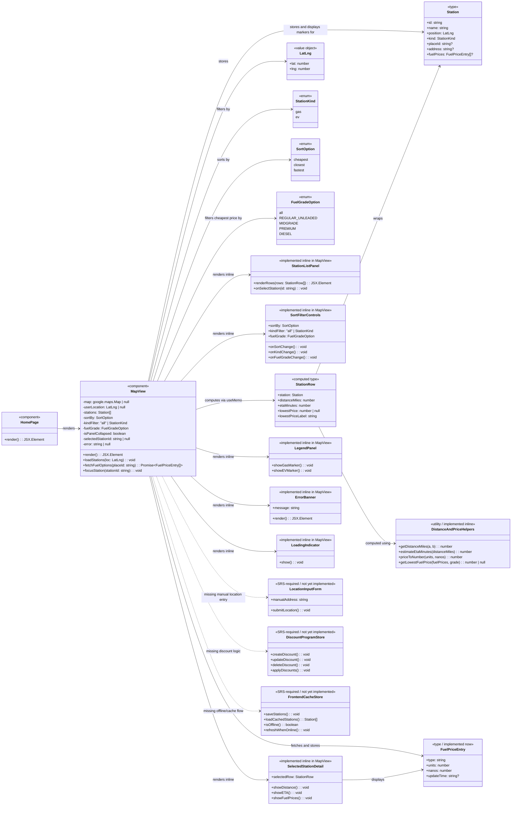
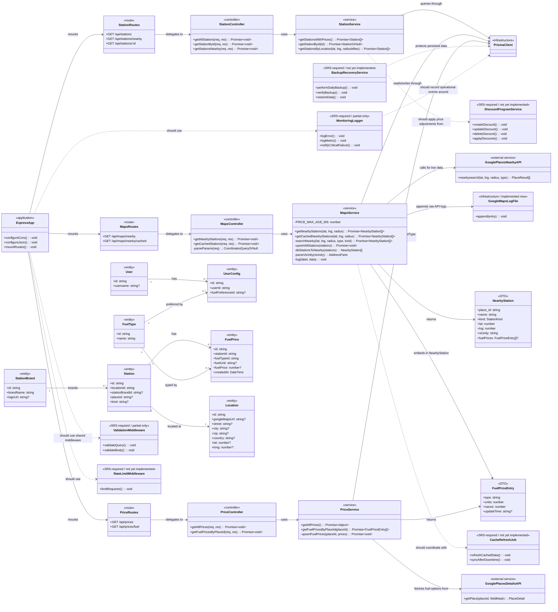

# Find A Pump Class Diagrams

These class diagrams reflect the current repository implementation and the remaining SRS-required responsibilities.

- Implemented now: responsibility exists in code today.
- Implemented inline: logic exists but is embedded (not a dedicated module/class).
- SRS-required / not yet implemented: requirement appears in SRS but no dedicated implementation exists.

## Frontend Class Diagram

### Frontend Review Against Current Code

- Implemented now:
  - Home page renders the map component full-screen.
  - Map loads fallback area immediately, then re-fetches using geolocation if permission is granted.
  - Nearby stations are loaded from backend cached endpoint while backend refresh is fired in background.
  - Sort/filter controls include sort mode, station type, and fuel grade.
  - Selected station detail includes distance, ETA, lowest price, and per-grade gas prices.
  - Marker info window for selected station shows station details and gas price rows.
  - Inline legend and inline error/loading states are implemented.
- Missing relative to SRS:
  - Manual location entry form.
  - Navigation/directions links (especially EV routing flow).
  - Discount program CRUD and application logic.
  - Frontend offline cache store and sync strategy.

## Backend Class Diagram

### Backend Review Against Current Code

- Implemented now:
  - Express app with CORS allowlist + private-network pattern and JSON middleware.
  - Route/controller/service separation for station, map, and price APIs.
  - Maps service fetches gas and EV places, returns combined results, and persists station/location/brand cache asynchronously.
  - Cached map endpoint reads local DB and includes fresh fuel prices (24h threshold).
  - Price service calls Google Places Details API (v1), normalizes fuel prices, and upserts FuelType/FuelPrice rows asynchronously.
  - Station service returns related location/brand/fuel data, with fuel prices sorted ascending.
  - Prisma entities for user config, fuel types, stations, locations, brands, and fuel prices are in schema.
- Partial/missing relative to SRS:
  - `getAllPrices()` still returns a stub object. 
  - No discount-program domain model or CRUD endpoints.
  - No scheduled cache refresh worker/service.
  - Validation is handler-local only (no shared validation middleware layer).
  - No rate limiting middleware.
  - Logging is ad hoc (`console` plus append-to-file), not full monitoring/alerting.
  - No backup/recovery application module.

## Summary

The current implementation supports end-to-end nearby discovery, sorting/filtering, and station-level fuel-price display with DB-backed caching. The largest SRS gaps remain manual location entry, discount management, frontend offline strategy, and backend operational hardening (shared validation, rate limiting, monitoring, backup/recovery).
